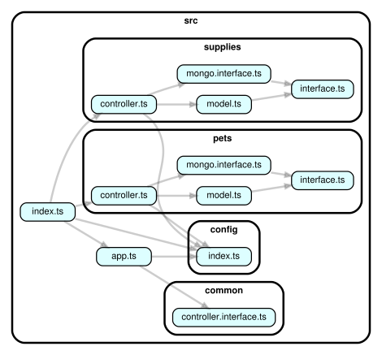

# Express Practice
RESTful API with Node, Express, Mongo and TypeScript. Built as a part of onboarding activities.

## Code Structure



## Getting Started

These instructions will give you a copy of the project up and running on your local machine.

### Prerequisites

- Recent NodeJS version
- MongoDB (running locally on port 27017, without Auth)

### Installing
- Clone the repository:
  ```git clone https://github.com/npalladium/express-practice.git```
- Install the dependencies:
  ```npm install --include=dev```
- Setup .env with MONGO_URL:
  ```mv sample.env .env    # in case of no auth default mongo```
- Build and start the server:
  ```npm run start```

### Test Plan
- Use curl to test the end points.
  * Unit tests have not been setup as there is minimal "business logic".
  * End-to-end tests can be done manually with curl as this is a small app.

### Style
- Run prettier with:
  ```npm run pretty```
- Run linter with:
  ```npm run lint```

## TODO
- Return validation based errors to end user
- Add Auth
- Add tests

## License
The code in this repository is provided under the MIT License.
